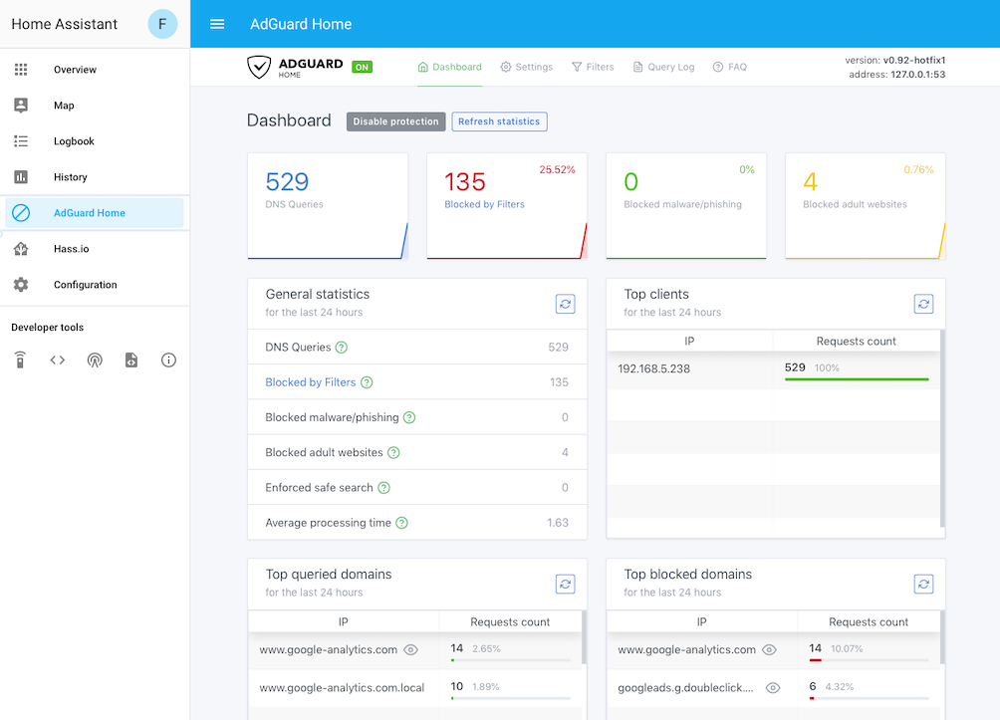

# Community Hass.io Add-ons: AdGuard Home

[![GitHub Release][releases-shield]][releases]
![Project Stage][project-stage-shield]
[![License][license-shield]](LICENSE.md)

![Supports aarch64 Architecture][aarch64-shield]
![Supports amd64 Architecture][amd64-shield]
![Supports armhf Architecture][armhf-shield]
![Supports armv7 Architecture][armv7-shield]
![Supports i386 Architecture][i386-shield]

[![GitLab CI][gitlabci-shield]][gitlabci]
![Project Maintenance][maintenance-shield]
[![GitHub Activity][commits-shield]][commits]

[![Discord][discord-shield]][discord]
[![Community Forum][forum-shield]][forum]

[![Buy me a coffee][buymeacoffee-shield]][buymeacoffee]

[![Support my work on Patreon][patreon-shield]][patreon]

Network-wide ads & trackers blocking DNS server.



## About

AdGuard Home is a network-wide ad-and-tracker blocking DNS server with
parental control (adult content blocking) capabilities. Its purpose is to let
you control your entire network and all your devices, and it does not require
using a client-side program.

AdGuard Home provides a beautiful, easy and feature-rich web interface to
easily manage the filtering process and its settings.

## Installation

The installation of this add-on is pretty straightforward and not different in
comparison to installing any other Hass.io add-on.

1. **Ensure your Hass.io device has a static IP and static external DNS servers!**
1. [Add our Hass.io add-ons repository][repository] to your Hass.io instance.
1. Install the "AdGuard Home" add-on.
1. Start the "AdGuard Home" add-on.
1. Check the logs of the "AdGuard Home" to see if everything went well.
1. Click the "OPEN WEB UI" button and log in with your Home Assistant account.
1. Ready to go!

**NOTE**: Do not add this repository to Hass.io, please use:
`https://github.com/hassio-addons/repository`.

## Configuration

**Note**: _Remember to restart the add-on when the configuration is changed._

Example add-on configuration:

```json
{
  "log_level": "info",
  "dns_port": 53,
  "admin_port": 3210,
  "ssl": true,
  "certfile": "fullchain.pem",
  "keyfile": "privkey.pem"
}
```

**Note**: _This is just an example, don't copy and paste it! Create your own!_

### Option: `log_level`

The `log_level` option controls the level of log output by the addon and can
be changed to be more or less verbose, which might be useful when you are
dealing with an unknown issue. Possible values are:

- `trace`: Show every detail, like all called internal functions.
- `debug`: Shows detailed debug information.
- `info`: Normal (usually) interesting events.
- `warning`: Exceptional occurrences that are not errors.
- `error`:  Runtime errors that do not require immediate action.
- `fatal`: Something went terribly wrong. Add-on becomes unusable.

Please note that each level automatically includes log messages from a
more severe level, e.g., `debug` also shows `info` messages. By default,
the `log_level` is set to `info`, which is the recommended setting unless
you are troubleshooting.

### Option: `dns_port`

Allows you to change the DNS port. `53` is the default port for DNS. Unless you
have a good reason to change it, leave it to `53`.

### Option: `admin_port`

Changes the port on which the AdGuard Home web interface will be served from.

### Option: `ssl`

Enables/Disables SSL (HTTPS) on the add-on. Set it `true` to enable it,
`false` otherwise.

### Option: `certfile`

The certificate file to use for SSL.

**Note**: _The file MUST be stored in `/ssl/`, which is default for Hass.io_

### Option: `keyfile`

The private key file to use for SSL.

**Note**: _The file MUST be stored in `/ssl/`, which is default for Hass.io_

### Option: `leave_front_door_open`

Adding this option to the add-on configuration allows you to disable
authentication on the AdGuard Home by setting it to `true`.

**Note**: _We STRONGLY suggest, not to use this, even if this add-on is
only exposed to your internal network. USE AT YOUR OWN RISK!_

## Embedding into Home Assistant

It is possible to embed the AdGuard Home admin directly into Home Assistant,
allowing you to access the admin through the Home Assistant frontend.

Home Assistant provides the `panel_iframe` component, for these purposes.

Example configuration:

```yaml
panel_iframe:
  adguard:
    title: AdGuard Home
    icon: mdi:block-helper
    url: http://addres.to.your.hass.io:3210
```

## Changelog & Releases

This repository keeps a change log using [GitHub's releases][releases]
functionality. The format of the log is based on
[Keep a Changelog][keepchangelog].

Releases are based on [Semantic Versioning][semver], and use the format
of ``MAJOR.MINOR.PATCH``. In a nutshell, the version will be incremented
based on the following:

- ``MAJOR``: Incompatible or major changes.
- ``MINOR``: Backwards-compatible new features and enhancements.
- ``PATCH``: Backwards-compatible bugfixes and package updates.

## Support

Got questions?

You have several options to get them answered:

- The [Community Hass.io Add-ons Discord chat server][discord] for add-on
  support and feature requests.
- The [Home Assistant Discord chat server][discord-ha] for general Home
  Assistant discussions and questions.
- The Home Assistant [Community Forum][forum].
- Join the [Reddit subreddit][reddit] in [/r/homeassistant][reddit]

You could also [open an issue here][issue] GitHub.

## Contributing

This is an active open-source project. We are always open to people who want to
use the code or contribute to it.

We have set up a separate document containing our
[contribution guidelines](CONTRIBUTING.md).

Thank you for being involved! :heart_eyes:

## Authors & contributors

The original setup of this repository is by [Franck Nijhof][frenck].

For a full list of all authors and contributors,
check [the contributor's page][contributors].

## We have got some Hass.io add-ons for you

Want some more functionality to your Hass.io Home Assistant instance?

We have created multiple add-ons for Hass.io. For a full list, check out
our [GitHub Repository][repository].

## License

MIT License

Copyright (c) 2019 Franck Nijhof

Permission is hereby granted, free of charge, to any person obtaining a copy
of this software and associated documentation files (the "Software"), to deal
in the Software without restriction, including without limitation the rights
to use, copy, modify, merge, publish, distribute, sublicense, and/or sell
copies of the Software, and to permit persons to whom the Software is
furnished to do so, subject to the following conditions:

The above copyright notice and this permission notice shall be included in all
copies or substantial portions of the Software.

THE SOFTWARE IS PROVIDED "AS IS", WITHOUT WARRANTY OF ANY KIND, EXPRESS OR
IMPLIED, INCLUDING BUT NOT LIMITED TO THE WARRANTIES OF MERCHANTABILITY,
FITNESS FOR A PARTICULAR PURPOSE AND NONINFRINGEMENT. IN NO EVENT SHALL THE
AUTHORS OR COPYRIGHT HOLDERS BE LIABLE FOR ANY CLAIM, DAMAGES OR OTHER
LIABILITY, WHETHER IN AN ACTION OF CONTRACT, TORT OR OTHERWISE, ARISING FROM,
OUT OF OR IN CONNECTION WITH THE SOFTWARE OR THE USE OR OTHER DEALINGS IN THE
SOFTWARE.

[aarch64-shield]: https://img.shields.io/badge/aarch64-yes-green.svg
[amd64-shield]: https://img.shields.io/badge/amd64-yes-green.svg
[armhf-shield]: https://img.shields.io/badge/armhf-yes-green.svg
[armv7-shield]: https://img.shields.io/badge/armv7-yes-green.svg
[buymeacoffee-shield]: https://www.buymeacoffee.com/assets/img/guidelines/download-assets-sm-2.svg
[buymeacoffee]: https://www.buymeacoffee.com/frenck
[commits-shield]: https://img.shields.io/github/commit-activity/y/hassio-addons/addon-adguard-home.svg
[commits]: https://github.com/hassio-addons/addon-adguard-home/commits/master
[contributors]: https://github.com/hassio-addons/addon-adguard-home/graphs/contributors
[discord-ha]: https://discord.gg/c5DvZ4e
[discord-shield]: https://img.shields.io/discord/478094546522079232.svg
[discord]: https://discord.me/hassioaddons
[dockerhub]: https://hub.docker.com/r/hassioaddons/adguard
[forum-shield]: https://img.shields.io/badge/community-forum-brightgreen.svg
[forum]: https://community.home-assistant.io/t/community-hass-io-add-on-adguard-home/90684?u=frenck
[frenck]: https://github.com/frenck
[gitlabci-shield]: https://gitlab.com/hassio-addons/addon-adguard-home/badges/master/pipeline.svg
[gitlabci]: https://gitlab.com/hassio-addons/addon-adguard-home/pipelines
[home-assistant]: https://home-assistant.io
[i386-shield]: https://img.shields.io/badge/i386-yes-green.svg
[issue]: https://github.com/hassio-addons/addon-adguard-home/issues
[keepchangelog]: http://keepachangelog.com/en/1.0.0/
[license-shield]: https://img.shields.io/github/license/hassio-addons/addon-adguard-home.svg
[maintenance-shield]: https://img.shields.io/maintenance/yes/2019.svg
[microbadger]: https://microbadger.com/images/hassioaddons/adguard
[patreon-shield]: https://www.frenck.nl/images/patreon.png
[patreon]: https://www.patreon.com/frenck
[project-stage-shield]: https://img.shields.io/badge/project%20stage-experimental-yellow.svg
[reddit]: https://reddit.com/r/homeassistant
[releases-shield]: https://img.shields.io/github/release/hassio-addons/addon-adguard-home.svg
[releases]: https://github.com/hassio-addons/addon-adguard-home/releases
[repository]: https://github.com/hassio-addons/repository
[semver]: http://semver.org/spec/v2.0.0.htm
